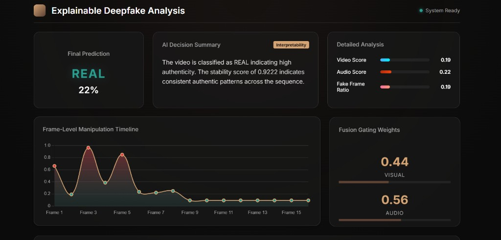
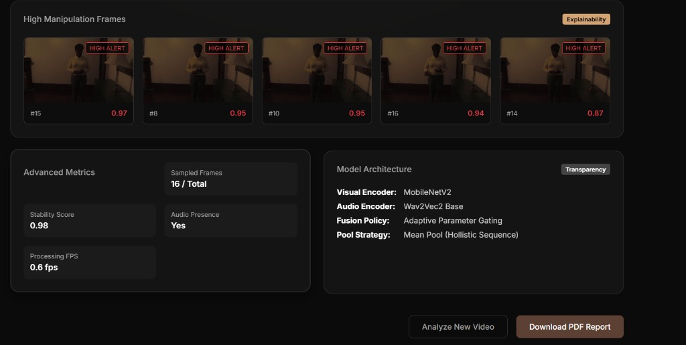
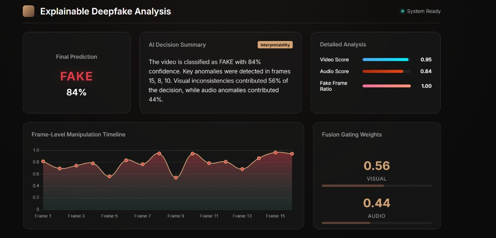

# Explainable Deepfake Analysis

Multimodal deepfake detection with interpretable outputs, combining visual and audio evidence through adaptive fusion.  
This project provides a complete workflow: upload video, run analysis, inspect frame-level evidence, and download a PDF report.

## What This Project Does

- Classifies video as `Real` or `Fake`
- Shows confidence and per-frame manipulation scores
- Exposes modality contribution (`visual` vs `audio`) via fusion weights
- Surfaces top suspicious frames for explainability
- Generates a downloadable analysis report

## Dashboard Preview





## Why It Is Useful

Most detection demos return only a final label. This system is designed for transparency:

- **Global explanation**: final prediction and confidence
- **Temporal explanation**: frame-level fake probability timeline
- **Modal explanation**: adaptive gate showing reliance on visual vs audio evidence

This makes the output easier to audit in practical forensic and research settings.

## Technical Overview

### Model

- Visual encoder: `MobileNetV2`
- Audio encoder: `Wav2Vec2 Base` (`facebook/wav2vec2-base`)
- Fusion: adaptive scalar gate
- Classifier: MLP over fused embeddings

### Pipeline

1. Sample frames from input video
2. Detect and crop face regions
3. Extract mono 16 kHz audio via `ffmpeg`
4. Run frame-wise and sequence-wise inference
5. Rank top manipulated frames
6. Return structured JSON + optional PDF

## Project Structure

```text
deepfake_detection/
├── README.md
└── deepfake_app/
    ├── backend/
    │   ├── main.py
    │   ├── model.py
    │   ├── debug.py
    │   ├── debug_model.py
    │   └── requirements.txt
    ├── frontend/
    │   ├── index.html
    │   ├── style.css
    │   └── script.js
    ├── uploads/
    │   └── deepfake_detection.py
    └── assets/
        ├── dashboard-real.png
        ├── dashboard-details.png
        └── dashboard-fake.png
```

## Quick Start

### 1) Install dependencies

```bash
cd deepfake_app/backend
pip install -r requirements.txt
```

### 2) Run backend API

```bash
cd deepfake_app/backend
python main.py
```

Backend runs at: `http://localhost:8000`

### 3) Open frontend

Open `deepfake_app/frontend/index.html` in your browser.  
Upload a `.mp4` or `.avi` file and run analysis.

## API Endpoints

### `POST /api/analyze`

- Input: multipart form-data with `video`
- Output: prediction, confidence, frame scores, top frames, fusion weights, metadata

### `POST /api/report`

- Input: JSON result from `/api/analyze`
- Output: PDF report download

## Core Output Fields

- `prediction`
- `confidence`
- `video_score`
- `audio_score`
- `fake_frame_ratio`
- `frame_predictions`
- `fusion_weights`
- `top_frames`
- `decision_summary`
- `metadata`

## Limitations

- Requires `best_model.pt` for meaningful predictions
- Face detection can fail under occlusion, extreme angles, or low-light videos
- Depends on system `ffmpeg` installation
- Fixed input lengths may not capture all long-video artifacts

## Future Improvements

- Add test suite for API endpoints
- Add model versioning and checkpoint provenance
- Add configurable frontend API URL
- Add benchmark table with ACC/F1/AUC across conditions